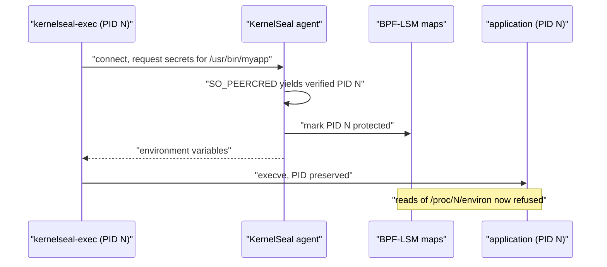

# KernelSeal

[](https://github.com/phonginreallife/kernelseal/actions/workflows/ci.yaml)
[](https://github.com/phonginreallife/kernelseal/actions/workflows/security.yaml)
[](https://goreportcard.com/report/github.com/phonginreallife/kernelseal)
[](https://github.com/phonginreallife/kernelseal/releases/latest)
[](LICENSE)

**Kernel-level secret protection for Kubernetes using eBPF and BPF-LSM**


KernelSeal delivers application secrets directly into a process's environment at
exec time and uses BPF-LSM to stop anything else on the host from reading them
back out. Secrets are never written to the container filesystem, never mounted as
a volume, and cannot be recovered from `/proc/<pid>/environ` afterwards, even by
root inside the container.

## Key features

- **No secrets on disk.** Values move from the agent to the target process over a
  unix socket. Nothing is written to a file or a tmpfs mount.
- **Ordinary environment variables.** The application reads `os.Getenv` or
  `$DB_PASSWORD` as usual. No SDK, no code changes.
- **Protected before the process starts.** The agent marks the PID protected
  before it returns any secrets, so the environment is never readable, not even
  for a moment.
- **Kernel-enforced.** BPF-LSM refuses reads of `/proc/<pid>/environ`,
  `/proc/<pid>/mem` and `/proc/<pid>/maps`, and blocks `ptrace` attach.
- **Fails closed.** In enforce mode, secrets are withheld entirely if the kernel
  cannot guarantee protection.
- **Low overhead.** Optional kernel-side filtering means unrelated processes never
  generate events.

## How it works

An application's entrypoint is wrapped with `kernelseal-exec`, a small static
shim. The shim asks the agent for the secrets bound to the binary it is about to
run, applies them to the environment, and then `execve`s the real program.



The ordering is the point. Because protection is installed before the secrets are
released, and because `execve` preserves the PID, the application inherits both
the environment and the protection. There is no window in which a protected
process is running with readable secrets.

Three things follow from this design:

The agent identifies its caller with `SO_PEERCRED`, which the kernel fills in and
the caller cannot forge. Secret delivery is therefore tied to a real process, not
to anything the client asserts about itself. From that PID the agent reads the
caller's cgroup, which the kernel set when the container was created, and resolves
it to a pod. That pod, not the binary name in the request, is what authorizes the
request. The binary name only narrows which of that pod's bindings apply.

Cleanup is driven by the `sched_process_exit` tracepoint, backed by a periodic
reconciler that drops protection for PIDs that no longer exist. Without the
reconciler, an evicted LRU entry could leave protection attached to a PID that is
later reused by an unrelated process.

Enforcement is a policy decision with three modes: `disabled`, `audit` (log
would-be denials but allow them), and `enforce` (log and deny).

## Requirements

- **Kernel:** Linux >= 5.7 with BPF-LSM enabled
- **Kernel config:**
  ```
  CONFIG_BPF=y
  CONFIG_BPF_SYSCALL=y
  CONFIG_BPF_LSM=y
  CONFIG_DEBUG_INFO_BTF=y
  ```
- **Boot parameters:** `lsm=lockdown,capability,yama,bpf` (the `bpf` entry is what
  matters)
- **Capabilities:** `SYS_ADMIN`, `BPF`, `PERFMON`, and `SYS_RESOURCE` (the last is
  needed to raise `RLIMIT_MEMLOCK` for BPF maps)
- **Kubernetes:** 1.20+
- **Container runtime:** containerd or CRI-O

### Checking support

```bash
# The output must contain "bpf"
cat /sys/kernel/security/lsm

# BTF must be present for CO-RE
ls /sys/kernel/btf/vmlinux
```

If `/sys/kernel/security/lsm` does not list `bpf`, KernelSeal starts but cannot
enforce anything. In enforce mode it will refuse to release secrets and report
`not ready` on its readiness probe rather than pretend to protect them.

## Quick start

### Build from source

```bash
git clone https://github.com/phonginreallife/kernelseal.git
cd kernelseal

# Requires clang, llvm, libbpf-dev and bpftool
make all

# Verify everything before running
make verify
```

This produces two binaries:

| Binary | Runs where | Purpose |
|---|---|---|
| `build/kernelseal` | Privileged sidecar or DaemonSet | Loads BPF, serves secrets |
| `build/kernelseal-exec` | Inside the application container | Wraps the entrypoint |

### Try it locally

```bash
# 1. Start the agent with the secret in its own environment.
#    Pass the value on the sudo command line rather than exporting it and using
#    sudo -E: many sudoers configurations reject -E outright with "preserving the
#    entire environment is not supported", and the agent then starts with the
#    source variable unset. It registers 0 secrets, the shim is told the binary
#    has nothing bound to it, and nothing is protected.
#    -socket-group hands the socket to your group so the shim can reach it: the
#    agent runs as root, and a 0660 socket would otherwise be root-only.
sudo MY_SECRET_VALUE="super-secret-value" ./build/kernelseal \
  -config examples/config.yaml \
  -exec-monitor bpf/exec_monitor.bpf.o \
  -lsm bpf/lsm_file_protect.bpf.o \
  -socket-group "$(id -gn)"

# Check the log says "[REGISTER] 2 secrets registered for binary: sleep".
# A 0 there means the secret sources did not resolve, and step 3 will succeed
# rather than being denied.

# 2. In another shell, start a process through the shim
./build/kernelseal-exec -- sleep 300 &
SLEEP_PID=$!

# 3. The secret is in its environment, but unreadable from here
cat /proc/$SLEEP_PID/environ
# cat: /proc/1234/environ: Operation not permitted
```

### Deploy to Kubernetes

#### 1. Check the nodes first

Everything depends on the node being booted with `bpf` in its `lsm=` list, which
is not the default on most distributions. The probe answers that in about twenty
seconds. It uses the published image, so the node needs no toolchain, and it runs
in `audit` mode with no secret bindings, so nothing can be blocked and no secret
is read. That makes it safe to run against a production node.

```bash
kubectl apply -f deploy/kernelseal-probe.yaml
kubectl logs -f job/kernelseal-probe
kubectl delete -f deploy/kernelseal-probe.yaml
```

It ends with `RESULT: node is ready for KernelSeal`, or one `[FAIL]` line per
unmet requirement with the fix for each. The probe loads and attaches for real,
because every static check can pass on a node where the attach still fails.

#### 2. Sidecar, one agent per pod (start here)

Socket reachability is the authorization boundary: any process that can open the
delivery socket can request the secrets bound to any configured binary by naming
it. A per-pod agent keeps that socket inside the pod the secrets belong to, so
this is the pattern to reach for first.

[deploy/kernelseal-sidecar.yaml](deploy/kernelseal-sidecar.yaml) is a complete
runnable example. The pieces an application pod needs are:

```yaml
spec:
  shareProcessNamespace: true   # so the agent can protect the app's processes
  securityContext:
    fsGroup: 1000               # so both containers can use the socket

  initContainers:
  # Copies the shim in, so the application image needs no changes
  - name: install-shim
    image: ghcr.io/phonginreallife/kernelseal:v1.0.0
    command: ["/bin/sh", "-c", "cp /usr/local/bin/kernelseal-exec /kernelseal/"]
    volumeMounts:
    - {name: kernelseal-bin, mountPath: /kernelseal}

  containers:
  - name: myapp
    image: myapp:latest
    # The original entrypoint becomes an argument to the shim
    command: ["/kernelseal/kernelseal-exec", "--", "/usr/bin/myapp"]
    volumeMounts:
    - {name: kernelseal-bin, mountPath: /kernelseal, readOnly: true}
    - {name: kernelseal-socket, mountPath: /run/kernelseal}

  volumes:
  - name: kernelseal-bin
    emptyDir: {}
  - name: kernelseal-socket
    emptyDir: {medium: Memory, sizeLimit: 1Mi}
```

#### 3. DaemonSet, one agent per node

A node-wide agent serves a single socket to every pod that mounts it, so any pod
on the node can ask for any configured binary's secrets. Use it only where every
workload on the node is equally trusted, such as a single-tenant cluster or a
dedicated node group, and read the authorization boundary section of
[SECURITY.md](SECURITY.md) first.

```bash
kubectl apply -f deploy/manifests/namespace.yaml
kubectl apply -f deploy/manifests/configmap.yaml
kubectl apply -f deploy/manifests/daemonset.yaml
```

## Configuration

```yaml
version: v1

policy:
  mode: enforce              # disabled, audit, enforce
  blockEnviron: true         # Block /proc/*/environ
  blockMem: true             # Block /proc/*/mem
  blockMaps: false           # Block /proc/*/maps
  blockPtrace: true          # Block ptrace attach
  allowSelfRead: true        # Let a process read its own /proc files
  auditAll: false            # Log allowed accesses too
  kernelBinaryFilter: true   # Only observe configured binaries
  podIdentity: preferred     # required on a node-wide agent, see below

secrets:
  - name: database-creds
    selector:
      binary: "postgres"     # Narrows which of this pod's bindings apply
      namespace: production  # Authorizes: comes from the caller's cgroup
      labels:
        app: database
    secretRefs:
      - name: PGPASSWORD
        source:
          envRef: "PG_PASSWORD_SOURCE"

monitoring:
  enabled: true
  metricsPort: 9090
  logLevel: info
```

A binary listed under `secrets` only receives them if it is started through the
shim. Adding a binding does not affect processes launched any other way.

### Who a binding applies to

`binary` is a claim: at handshake time the caller has not exec'd yet, so the agent
cannot verify it. The selector fields that authorize are the ones derived from the
caller's cgroup, which a container cannot change from inside itself.

| Field | Source | Authorizes |
|---|---|---|
| `binary` | The request | No. Narrows only. |
| `namespace` | Caller's cgroup, then the API server | Yes |
| `labels` | Caller's cgroup, then the API server | Yes |
| `container` | Caller's cgroup, then the API server | Yes |
| `cgroupPath` | Caller's cgroup | Yes, and needs no API access |

`policy.podIdentity` sets how strictly this is applied, which depends on who can
reach the socket:

| Mode | Behavior | Use for |
|---|---|---|
| `preferred` (default) | Enforces pod selectors when present; still serves bindings that have none | The per-pod sidecar, where the socket is already scoped to one pod |
| `required` | Refuses callers it cannot attribute to a pod, and rejects bindings that name no pod | A node-wide DaemonSet, where every pod on the node can open the socket |
| `disabled` | Does not identify callers at all | The pre-1.2.0 behavior, when needed deliberately |

In `required` mode the agent needs `pods: get/list/watch` and a `NODE_NAME` from
`spec.nodeName`; it watches only its own node's pods. It refuses to start if it
cannot, rather than running while refusing every request.

### Secret sources

```yaml
secretRefs:
  # Literal value, useful for testing
  - name: TOKEN
    source:
      value: "inline-value"

  # From the agent's own environment
  - name: DB_PASSWORD
    source:
      envRef: "SOURCE_DB_PASSWORD"

  # From a file, e.g. written by a Vault agent sidecar
  - name: API_KEY
    source:
      fileRef: "/vault/secrets/api-key"

  # From a Kubernetes Secret mounted into the agent container
  - name: JWT_SECRET
    source:
      secretKeyRef:
        name: my-secret
        key: jwt
```

`secretKeyRef` reads the value from a mounted path rather than calling the
Kubernetes API; mount the Secret into the agent container at
`/var/run/secrets/kernelseal/<name>/<key>`. `vaultRef` is accepted by the parser
but not yet implemented and returns an error.

### Kernel-side binary filtering

| Setting | Behavior | Use case |
|---|---|---|
| `false` | Observe every exec on the host | Development, debugging |
| `true` | Observe only configured binaries | Production |

## Observability

The agent serves three endpoints on `metricsPort`:

| Path | Purpose |
|---|---|
| `/metrics` | Prometheus exposition |
| `/healthz` | Liveness. Succeeds whenever the process is running |
| `/ready` | Readiness. Fails when policy requires BPF-LSM but it is not loaded |

Liveness deliberately does not depend on readiness, so a degraded agent is not
restarted in a loop.

`monitoring.logLevel` accepts `debug`, `info`, `warn` or `error` and defaults to
`info`. Per-exec tracing sits at `debug`, because a host that runs a configured
binary in a loop otherwise produces a continuous stream of `[EXEC]` lines that
buries everything else. Secret delivery and LSM decisions are logged at `info` and
above, so the default level shows what matters.

Metrics:

- `kernelseal_exec_events_total` - process executions observed
- `kernelseal_secrets_issued_total` - secrets released to processes
- `kernelseal_secrets_denied_total` - secret requests refused
- `kernelseal_access_blocked_total` - accesses blocked by the LSM
- `kernelseal_access_audit_total` - accesses audited but allowed
- `kernelseal_protected_pids` - currently protected processes
- `kernelseal_lsm_loaded` - 1 when the LSM programs are attached
- `kernelseal_pods_watched` - pods cached for caller attribution, present only
  when the pod watcher is running. Zero on a node-wide agent means every request
  is being refused

Example log output:

```
[START] Starting KernelSeal - Secret Protection System
   Version: v1.0.0
[CONFIG] Loaded KernelSeal configuration from /etc/kernelseal/config.yaml
[CONFIG] Policy applied: mode=enforce podIdentity=required
[REGISTER] 2 secret(s) for binding "myapp" (binary="myapp", pod-scoped)
[OK] Exec monitor BPF programs loaded and attached
[FILTER] Kernel-side filtering enabled for 1 binaries: [myapp]
[OK] LSM BPF programs loaded and attached
[PODS] Watching 14 pod(s) on node ip-10-0-1-23.ec2.internal
[IDENTITY] Mode required: callers are attributed to a pod before any binding matches
[SOCKET] Listening on /run/kernelseal/kernelseal.sock (mode 0660)
[METRICS] Serving /metrics, /healthz and /ready on [::]:9090

[PROTECT] pid=5678 marked protected before release (pid=5678 uid=1000 ... pod=production/myapp-7d4f)
[ISSUE] Released 2 secrets to "myapp" [API_KEY DB_PASSWORD] (pid=5678 ...)
[LSM BLOCKED] PID=9999 (cat) uid=0 attempted environ access to PID=5678

[DENY] Refusing "myapp" to pid=6001: no binding admits this caller;
       refused [myapp-secrets (namespace)] (pid=6001 ... pod=sandbox/scratch-xyz)
```

## Testing

```bash
make verify            # formatting, vet, ABI check, unit and delivery tests
make test              # unit tests only
make test-delivery     # end-to-end secret delivery, no privileges needed
make test-integration  # adds LSM enforcement tests, needs root and BPF-LSM
```

`make test-delivery` runs the real socket handshake and exec path, so it covers
the delivery mechanism on any machine. The LSM enforcement tests in
`make test-integration` skip unless they find root and a kernel booted with `bpf`
in its `lsm=` list.

### The ABI check

`make abi-check` covers two failure modes that are invisible at build time.

First, it verifies that the Go structs in
[internal/types/events.go](internal/types/events.go) still match the C
definitions in [bpf/kernelseal_common.h](bpf/kernelseal_common.h), field by field,
including the padding C inserts implicitly. This matters more than it looks: both
sides of the policy struct are 8 bytes, so a mismatched field order still updates
the map successfully and simply writes each setting to the wrong byte. The
enforced policy then differs from the configured one with no error anywhere.

Second, it checks that every program and map the loader resolves by name actually
exists in the compiled objects. Those names come from `ebpf:"..."` struct tags,
so a rename in the BPF source fails at agent startup rather than at compile time.

Both run in CI.

## Development

### Project structure

```
kernelseal/
├── bpf/
│   ├── exec_monitor.bpf.c       # Process lifecycle tracepoints
│   ├── lsm_file_protect.bpf.c   # LSM hooks: file_open, ptrace_access_check
│   └── kernelseal_common.h      # Shared event and policy layouts
├── cmd/
│   ├── main.go                  # Agent entrypoint
│   └── kernelseal-exec/         # The exec shim
├── internal/
│   ├── bpf/                     # BPF loading and map management
│   ├── cgroup/                  # Caller cgroup and pod UID resolution
│   ├── identity/                # Joins cgroup to pod for authorization
│   ├── kube/                    # Pod list-watch for this node
│   ├── metrics/                 # Prometheus and health endpoints
│   ├── protocol/                # Shim/agent wire format
│   ├── reconcile/               # Protected-PID reconciliation
│   ├── secrets/                 # Secret bindings and selector matching
│   ├── server/                  # Unix socket secret delivery
│   ├── types/                   # Shared types, ABI-pinned
│   └── policy.go                # Configuration and policy
├── deploy/                      # Kubernetes manifests
├── demo/                        # Docker compose demo
├── examples/                    # Example configurations
└── test/integration/            # Delivery and enforcement tests
```

### Building

```bash
make vmlinux    # generate bpf/vmlinux.h from the running kernel's BTF
make bpf        # compile the BPF programs
make build      # build both Go binaries
make docker     # build the container image

make build GOARCH=arm64   # cross-compile
```

`bpf/vmlinux.h` is generated and gitignored. On a host without BTF, build the BPF
objects in a container with `make docker-dev`.

## Security considerations

See [SECURITY.md](SECURITY.md) for the full threat model. In brief:

1. **The agent is privileged.** It needs `SYS_ADMIN`, `BPF`, `PERFMON` and
   `SYS_RESOURCE` to load BPF programs. Treat its image and config as trusted.
2. **Socket reachability is the authorization boundary.** Any process that can
   open the socket can request the secrets bound to any configured binary by
   naming it. Scope the socket volume to the pod that should receive those
   secrets.
3. **The shim is inside the trust boundary.** It handles plaintext secrets between
   the socket read and `execve`.
4. **`shareProcessNamespace: true` is required** for the sidecar pattern so the
   agent can protect application processes.
5. **Protection is per-PID and ends at exit.** A process that forks after
   receiving secrets passes its environment to children that are not themselves
   marked protected.

### Known limitations

- `vaultRef` is parsed but not implemented.
- The agent cannot verify which binary the shim will exec, because at handshake
  time `/proc/<pid>/exe` still points at the shim. The binary name selects which
  secrets apply; it is not an identity claim. Since 1.2.0 the caller's pod is what
  authorizes the request, so this separates pods but not processes inside one pod:
  any process in a pod can request any binding that pod is entitled to.
- Pod labels are mutable, so anyone who can patch a pod's labels can make it match
  a `labels` selector. Bind on `namespace` too.
- Cgroup-to-pod attribution has been verified against recorded path shapes for the
  systemd and cgroupfs drivers with containerd, CRI-O and Docker, but not yet on a
  live EKS node. See the 1.2.0 release notes.
- Go strings cannot be reliably zeroed, so secret values may persist in the
  agent's heap until garbage collected.

### Security scanning

CI runs gosec, govulncheck, Trivy, Hadolint and Gitleaks.

## License

Apache License 2.0

## Contributing

Contributions welcome. Please run `make verify` before opening a pull request.

## References

- [BPF LSM documentation](https://docs.kernel.org/bpf/prog_lsm.html)
- [Cilium eBPF library](https://github.com/cilium/ebpf)
- [Linux Security Modules](https://www.kernel.org/doc/html/latest/admin-guide/LSM/index.html)
