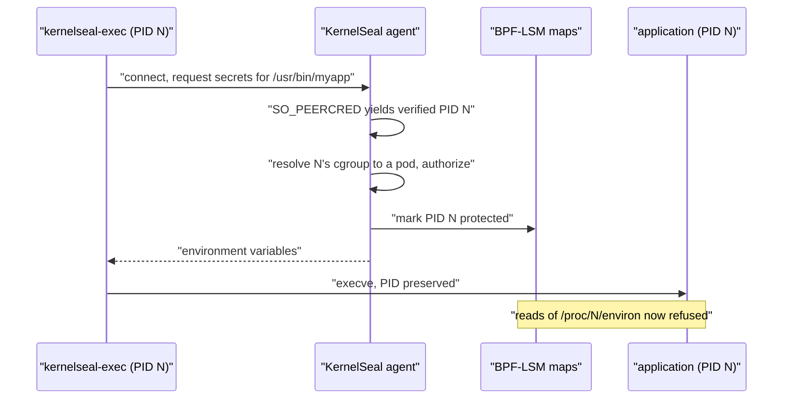

# How it works

An application's entrypoint is wrapped with `kernelseal-exec`, a small static
shim. The shim asks the agent for the secrets bound to the binary it is about to
run, applies them to the environment, and then `execve`s the real program.



## The ordering is the point

The naive version of this design has a hole in it. Deliver secrets to a process
and then protect it, and there is a window between those two events where the
secrets are readable.

So the order is inverted. The agent marks the calling PID protected **before** it
returns any values. The load-bearing detail is that `execve` **preserves the
PID**: the shim and the application it becomes are the same process, and that PID
was already in the protected set before any secret crossed the socket.

There is no window. The process is protected before it has anything worth
stealing, and it inherits both the environment and the protection through the
exec.

## What the kernel refuses

Two BPF-LSM hooks do the work:

| Hook | Refuses |
|---|---|
| `file_open` | Reads of `/proc/<pid>/environ`, `/proc/<pid>/mem` and `/proc/<pid>/maps` for protected PIDs |
| `ptrace_access_check` | Debugger attach to a protected process |

`allowSelfRead` lets a process inspect its own `/proc` files, because plenty of
runtimes do that at startup and breaking them buys nothing.

Enforcement is a policy decision with three modes: `disabled`, `audit` (log
would-be denials but allow them) and `enforce` (log and deny).

## Identity comes from the kernel

The agent identifies its caller with `SO_PEERCRED`, which the kernel fills in with
the peer's PID, UID and GID. A client cannot forge it. That is also what makes the
ordering possible: the agent knows which PID to protect because the kernel told
it, not because the caller said so.

`SO_PEERCRED` proves *which process* is calling. It does not prove *which binary
that process is about to become*, since at handshake time `/proc/<pid>/exe` still
points at the shim. Authorization therefore rests on the caller's cgroup rather
than on the binary name. See [Authorization](authorization.md).

## Cleanup, and why the reconciler exists

Protection has to be released when a process exits, or a recycled PID inherits it.
The `sched_process_exit` tracepoint drives that, backed by a periodic reconciler
that drops protection for PIDs that no longer exist. Without the reconciler, an
evicted LRU entry could leave protection attached to a PID later reused by an
unrelated process.

!!! note "`sched_process_exit` fires per thread, not per process"

    This caused a real protection leak. `kernelseal-exec` is a Go program, so it
    has a runtime with several threads, and when it execs its target those
    siblings exit first. Each was reported as the process exiting, protection was
    dropped moments after delivery, and `/proc/<pid>/environ` stayed readable for
    the life of the application.

    The fix is a kernel-side check on `signal->live`, emitting an exit event only
    when the last thread of the group leaves.

    A follow-up "second opinion" in user space, checking the process was really
    gone before unprotecting, then made things worse: `sched_process_exit` fires
    from inside `do_exit()`, so the task is still mid-exit when the event arrives
    and `/proc/<pid>` still exists. Every genuine exit looked alive, and cleanup
    fell entirely to the 30 second sweep. It shipped in one release and was
    reverted in the next.

## The ABI check

`make abi-check` covers two failure modes that are invisible at build time, and it
runs in CI.

First, it verifies that the Go structs in `internal/types/events.go` still match
the C definitions in `bpf/kernelseal_common.h` field by field, including padding
the compiler inserts implicitly. This matters more than it looks:

```c
struct ks_policy_config {
    __u8 enforce_mode;
    __u8 block_environ;
    __u8 block_mem;
    __u8 block_maps;
    __u8 block_ptrace;
    __u8 allow_self_read;
    __u8 audit_all;
    __u8 reserved;
};
```

Eight single-byte fields, eight bytes. Reorder two on the Go side and the struct
is still eight bytes, the map update still succeeds, and no error appears at any
layer. What changes is that each setting is written to the wrong byte, so the
enforced policy silently differs from the configured one.

Second, it checks that every program and map the loader resolves by name exists in
the compiled objects. Those names come from `ebpf:"..."` struct tags, so a rename
in the BPF source fails in CI rather than at someone's agent startup.
